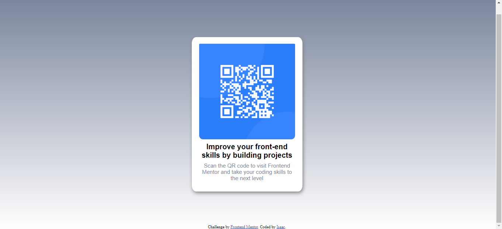

# Frontend Mentor - QR code component solution

This is a solution to the [QR code component challenge on Frontend Mentor](https://www.frontendmentor.io/challenges/qr-code-component-iux_sIO_H). Frontend Mentor challenges help you improve your coding skills by building realistic projects. 

## Table of contents

- [Overview](#overview)
  - [Screenshot](#screenshot)
  - [Links](#links)
- [My process](#my-process)
  - [Built with](#built-with)
  - [What I learned](#what-i-learned)
  - [Continued development](#continued-development)
  - [Useful resources](#useful-resources)
- [Author](#author)
- 

## Overview
Building a card layout with a QR code component, practicing some html and css skills.

### Screenshot




### Links

- Solution URL: [Add solution URL here](isaacvf-dev.github.io/qr-code-page/)


## My process

### Built with

- Semantic HTML5 markup
- CSS custom properties
- Flexbox


### What I learned

I got thinking if I should use <div> or <section>. Since <section> tag means that the content inside relates to a single theme, and <div> tag is used as a block part of the webpage and don't convey any particular meaning, I used the <section> tag.

```html
  <section class="container">
    
   
      <h1>Improve your front-end skills by building projects</h1>
      <p>Scan the QR code to visit Frontend Mentor and take your coding skills to the next level</p>    
  </section>
```
```css
.container {
  width: 300px;
  height: 420px;  
  align-items: center;
  margin-right: auto;
  margin-left: auto;
  margin-top: 130px;
  margin-bottom: 90px;
  display: flex;
  flex-direction: column;
  justify-content: space-evenly;
  background-color: hsl(0, 0%, 100%);
  box-shadow: 2px 4px 10px gray;
}
```


### Continued development

I'll study more about flexbox and grid. And responsive css as well.


### Useful resources

- [Resource 1](https://stackoverflow.com/questions/2869212/css3-gradient-background-set-on-body-doesnt-stretch-but-instead-repeats) - This discussion helped me figure out how to make my linear gradient continuous on the mobile screen format.
- [Resource 2](https://www.w3schools.com/cssref/css3_pr_box-shadow.php) - This is an amazing article which helped me remember about box-shadow. I'd recommend it to anyone still learning this concept.


## Author

- Frontend Mentor - [@Isaacvf-dev](https://www.frontendmentor.io/profile/Isaacvf-dev)
- LinkedIn - [Isaac Vieira](www.linkedin.com/in/isaac-vieira-francelino)


